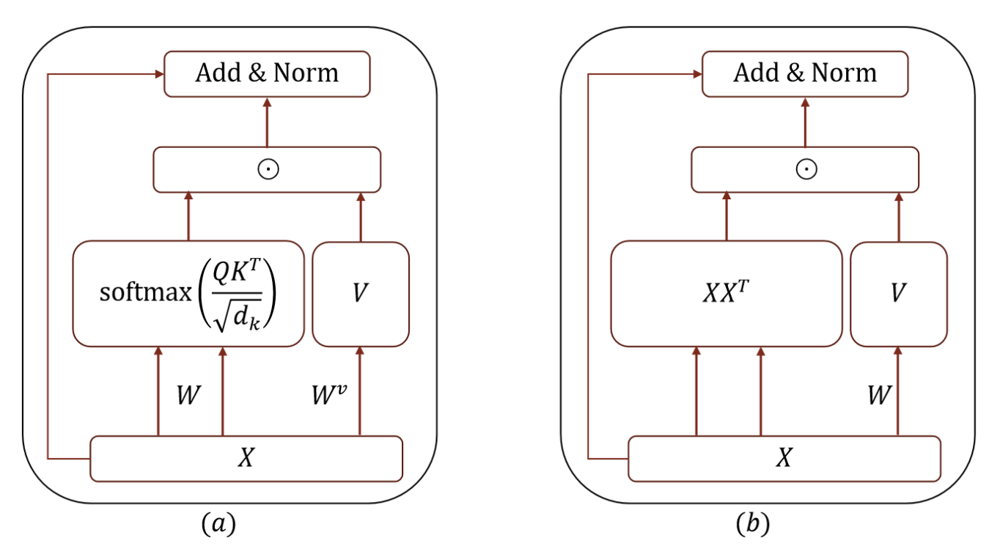

# Jittor-SimplTrans

Jittor-SimplTrans is a lightweight implementation of SimplTrans model using the Jittor deep learning framework.

SimplTrans proposes a parameter-free attention mechanism for transformers. By leveraging mathematical properties of square matrices, it eliminates unnecessary parameters in the attention module while maintaining performance. Benefits include:

- Reduced parameter count
- Improved computation efficiency
- Comparable performance across tasks


*Figure: Comparison between the original transformer architecture and the simplified transformer (SimplTrans) architecture*


## Features

- Standard Vision Transformer (ViT) implementation
- SimplTrans (Simplified Transformer) with different attention computation modes:
  - Identity attention
  - Random pattern attention
  - Diagonal pattern attention
- Example scripts for MNIST and CIFAR-10 classification
- Simple API and modular design

## Installation

To install the library locally:

```bash
git clone https://github.com/username/Jittor-SimplTrans
cd Jittor-SimplTrans
pip install -e .
```

## Usage

### Basic Usage

```python
from jittorsimpletrans import ViT, SimplTrans
import jittor as jt

# Create a standard ViT model
vit = ViT(
    image_size=28,       # input image size
    patch_size=4,        # patch size
    num_classes=10,      # number of classes
    dim=48,              # embedding dimension
    depth=12,            # transformer depth
    heads=3,             # number of attention heads
    mlp_dim=192,         # MLP hidden dimension
    channels=3,          # number of input channels
    dim_head=16,         # dimension per head
    dropout=0.1,         # dropout rate
    emb_dropout=0.1      # embedding dropout rate
)

# Sample input
x = jt.randn(8, 3, 28, 28)

# Forward pass
logits = vit(x)  # Shape: [8, 10]
```

### SimplTrans Usage

```python
# Create a SimplTrans model with identity attention mode
simpltrans = SimplTrans(
    image_size=28,
    patch_size=4,
    num_classes=10,
    dim=48,
    depth=12,
    heads=3,
    mlp_dim=192,
    channels=3,
    dim_head=16,
    dropout=0.1,
    emb_dropout=0.1,
    mode="identity"  # can also be "random" or "diagonal"
)

# Forward pass with the SimplTrans model
logits = simpltrans(x)
```

## Examples

Check out the examples in the `jittorsimpletrans/examples/` folder:

- `basic_usage.py`: Demonstrates the basic usage of both ViT and SimplTrans
- `mnist/train.py`: Training script for MNIST classification
- `cifar/train.py`: Training script for CIFAR-10 classification

To run an example:

```bash
python -m jittorsimpletrans.examples.basic_usage
python -m jittorsimpletrans.examples.mnist.train
python -m jittorsimpletrans.examples.cifar.train
```

## Requirements

- Jittor>=1.3.0
- NumPy>=1.19.0
- scikit-learn>=0.24.0
- tqdm>=4.50.0
- loguru>=0.5.0

## License

MIT License
